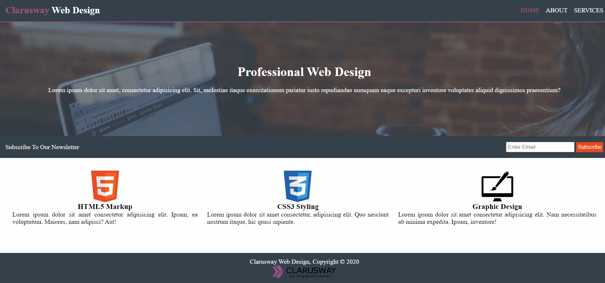

# Professional Web Design

## Description
This project aims to create a web page model.

## Project Skeleton

```

Professional-Web-Design (folder)
|
|----Images
|----index.html
|----About.html
|----Services.html
|----style.css
|----README.md
```

## Expected Outcome


## Steps to Solution

- Step 1: Clone project repo on Github

- Step 2: Create project folder for local public repo

- Step 3: Create Professional Web Design pages

## Resources

- [Images] (./Images)